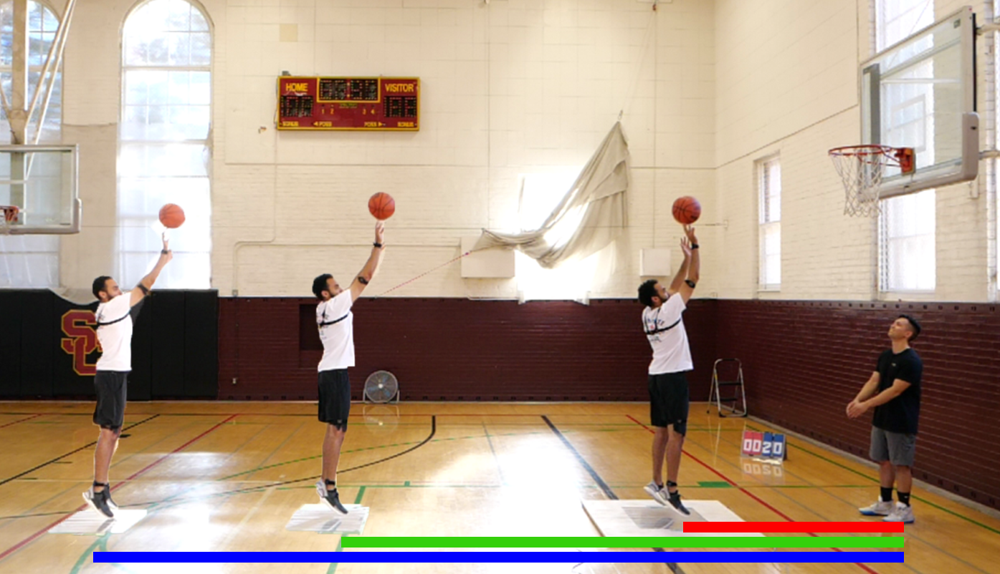

```{r, include=FALSE}
knitr::opts_chunk$set(echo = FALSE,
                      warning = FALSE,
                      tidy = FALSE,
                      message = FALSE,
                      fig.align = 'center',
                      out.width = "100%")
options(knitr.table.format = "html") 
# import packages
library(data.table)
library(dplyr)
library(ggplot2)
library(ggsignif)
library(RSQLite)
library(plotly)
library(gganimate)
source("../codes/Rallfun-v36")
```

```{r}
# create connection
database <- '../data/ASB2020_Database.sqlite'
conn <- dbConnect(SQLite(), database)
# load tables
data <- dbReadTable(conn, "data") %>% 
  mutate(distance = factor(distance, levels = c(6, 15, 19.75))) %>%
  mutate(distancename = if_else(distance == 6, "Short", ifelse(distance == 15, "Mid", "Long"))) %>% 
  mutate(distancename = factor(distancename, levels = c("Long", "Mid", "Short")))
cmdata <- dbReadTable(conn, "cmkinemdata")
dbDisconnect(conn)
# create athlete variable
ath <- sort(unique(data$athlete_id))
```
```{r}
# find release frame for each trial and the calculate time to apex from release
release_time <- cmdata %>% 
  group_by(trial_id) %>% 
  slice(which.max(time)) %>% 
  mutate(time2apex = -vel / -9.81) %>% 
  select("trial_id", "time2apex")
# merge with rest of data
data <- merge(data, release_time) %>% 
  mutate(time2apex_shotinit_lowerarm = setposition_time2release_lowerarm - time2apex,
         time2apex_shotinit_upperarm = setposition_time2release_upperarm - time2apex,
         time2apex_shotinit = min(setposition_time2release_upperarm,setposition_time2release_lowerarm) - time2apex)
```

# Introduction

- Known
  - Basketball shots are taken from varying distance from hoop
  - Distance affects max angular velocity [@Nakano2018] and timing of max upper extremity joint angular velocities [@Podmenik2017, @Miller1993] relative to ball release
  - Releasing the ball earlier relative to center of mass (CM) trajectory apex increases the CM vertical velocity contribution to ball vertical velocity [@Wiens]
- Unknown
  - How individuals control their upper extremity in relation to CM trajectory during shooting motion

## Hypothesis

- Upper extremity shot initiation would occur earlier relative to CM trajectory apex

# Methods

- Participants
  - 7 recreational players (4 female; college-aged)
- Basketball shot at game pace
  - Minimum 10 attempts at each distance
- Motion capture
  - Ball motion (Panasonic, 120Hz)
- Force-Time Characteristics
  - Net impulse = change in momentum (Kistler, 1200Hz)
- Wearable sensors
  - Arm segment motion (APDM, 120Hz)

# Stats
- Upper extremity shot initiation: earliest event of following:
  - Earliest event between: shoulder flexion or elbow extension
- Within-participant differences between shot distances
  - Multiple comparisons on difference scores
  - p-values adjusted using Benjamini-Hochberg method [@Wilcox2017]



# Results

```{r animateplot}
ggplot(data) +
  geom_point(aes(time2apex_shotinit, ball_velocity_release_y, color = athlete_id, shape = distancename)) +
  labs(x = "Time from Upper Extremity Shot Initiation to CM Trajectory Apex (s)",
       y = "Ball Vertical Velocity at Release (m/s)",
       color = "Participant",
       shape = "Distance") +
  geom_vline(aes(xintercept = 0), alpha = 0.4) +
  transition_states(distancename,
                    transition_length = 2,
                    state_length = 1) +
  shadow_mark()
```


# Discussion

- Changes in timing of upper extremity shot initiation in relation to CM trajectory apex were associated with differences in ball vertical velocity at release
- Timing of upper body shooting motion relative to whole body motion may affect ball release angle, subsequently affecting performance outcomes

# References
